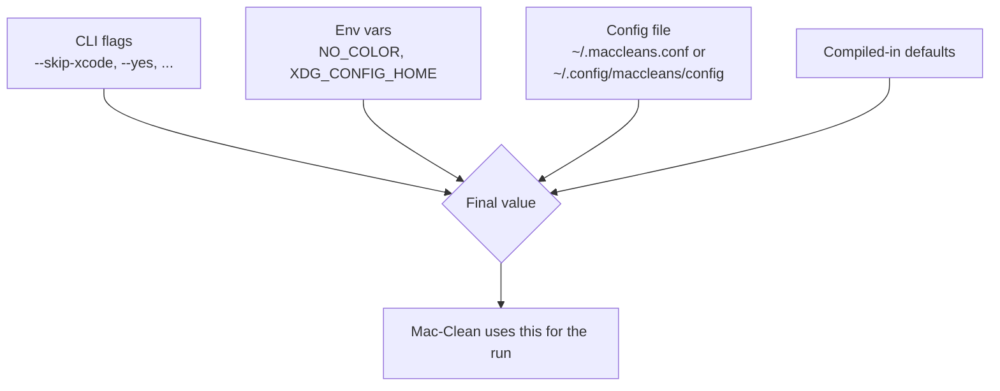

# Configuration

Customize MacCleans behavior with a configuration file or environment variables.

## Precedence



CLI flags override env vars. Env vars override config file. Config file overrides compiled-in defaults. The script picks the first config file it finds in this order:

1. `~/.maccleans.conf`
2. `~/.config/maccleans/config`
3. `${XDG_CONFIG_HOME:-$HOME/.config}/maccleans/config`

The first file found is loaded. Command-line arguments override config file settings.

## Config File Format

Create a config file at one of the locations above:

```bash
# ~/.maccleans.conf
# MacCleans configuration

# Behaviour
AUTO_YES=true
DRY_RUN=false
FORCE=false
QUIET=false
NO_COLOR=false
VERBOSE=false
JSON_OUTPUT=false
THRESHOLD=80

# Skips (true = skip this category)
SKIP_SNAPSHOTS=false
SKIP_HOMEBREW=false
SKIP_SPOTIFY=false
SKIP_CLAUDE=false
SKIP_XCODE=false
SKIP_BROWSERS=false
SKIP_NPM=false
SKIP_PIP=false
SKIP_TRASH=false
SKIP_DSSTORE=false
SKIP_DOCKER=false
SKIP_SIMULATOR=false
SKIP_MAIL=false
SKIP_SIRI_TTS=false
SKIP_ICLOUD_MAIL=false
SKIP_PHOTOS_LIBRARY=false
SKIP_ICLOUD_DRIVE=false
SKIP_QUICKLOOK=false
SKIP_DIAGNOSTICS=false
SKIP_IOS_BACKUPS=false
SKIP_IOS_UPDATES=false
SKIP_COCOAPODS=false
SKIP_GRADLE=false
SKIP_GO=false
SKIP_BUN=false
SKIP_PNPM=false
SKIP_BROWSER_TOOLS=false
SKIP_CRASH_REPORTS=false
SKIP_USER_TOOL_CACHES=false
SKIP_XCODE_ARCHIVES=false
SKIP_JVM=false
SKIP_JETBRAINS=false
SKIP_CARGO=false
SKIP_NUGET=false
SKIP_VSCODE=false
SKIP_SYSTEM_TMP=true
```

A complete, commented-out example is also available at the repo root as [`maccleans.conf.example`](../../maccleans.conf.example) — copy it to one of the locations above and edit.

## All Configuration Options

### Behavior Options

| Option | Values | Default | Description |
|--------|--------|---------|-------------|
| `AUTO_YES` | true/false | false | Skip confirmation prompts |
| `DRY_RUN` | true/false | false | Preview only, no deletion |
| `FORCE` | true/false | false | Skip ALL confirmations including dangerous operations |
| `QUIET` | true/false | false | Minimal output for cron/automation |
| `NO_COLOR` | true/false | false | Disable colored output |
| `VERBOSE` | true/false | false | Enable debug output |
| `JSON_OUTPUT` | true/false | false | Output results as JSON |
| `THRESHOLD` | 0-100 | 0 | Only run if disk usage is above this percentage |
| `UPDATE` | true/false | false | Run `brew update` before cleanup |

### Skip Options

Set to `true` to skip a category during cleanup.

| Option | Category |
|--------|----------|
| `SKIP_SNAPSHOTS` | Time Machine local snapshots |
| `SKIP_HOMEBREW` | Homebrew cache |
| `SKIP_SPOTIFY` | Spotify cache |
| `SKIP_CLAUDE` | Claude Desktop cache |
| `SKIP_XCODE` | Xcode Derived Data |
| `SKIP_BROWSERS` | Chrome, Firefox, Edge caches |
| `SKIP_NPM` | npm and Yarn cache |
| `SKIP_PIP` | Python pip cache |
| `SKIP_TRASH` | Trash bin |
| `SKIP_DSSTORE` | .DS_Store files |
| `SKIP_DOCKER` | Docker cache and data |
| `SKIP_SIMULATOR` | iOS Simulator data |
| `SKIP_MAIL` | Mail app cache |
| `SKIP_SIRI_TTS` | Siri text-to-speech cache |
| `SKIP_ICLOUD_MAIL` | iCloud Mail cache |
| `SKIP_PHOTOS_LIBRARY` | Photos library cache |
| `SKIP_ICLOUD_DRIVE` | iCloud Drive offline files |
| `SKIP_BROWSER_TOOLS` | Browser testing tool caches |
| `SKIP_CRASH_REPORTS` | Crash reports |
| `SKIP_USER_TOOL_CACHES` | User tool caches (`~/.cache/...`) |
| `SKIP_XCODE_ARCHIVES` | Xcode archives (requires `--force-xcode`) |
| `SKIP_JVM` | JVM build caches (Maven, Ivy, sbt) |
| `SKIP_JETBRAINS` | JetBrains IDE caches |
| `SKIP_CARGO` | Cargo registry cache |
| `SKIP_NUGET` | NuGet package cache |
| `SKIP_VSCODE` | VS Code cache |
| `SKIP_QUICKLOOK` | QuickLook thumbnails |
| `SKIP_DIAGNOSTICS` | Diagnostic reports |
| `SKIP_IOS_BACKUPS` | iOS device backups |
| `SKIP_IOS_UPDATES` | iOS/iPadOS update files |
| `SKIP_COCOAPODS` | CocoaPods cache |
| `SKIP_GRADLE` | Gradle cache |
| `SKIP_GO` | Go module cache |
| `SKIP_BUN` | Bun cache |
| `SKIP_PNPM` | pnpm cache |
| `SKIP_SYSTEM_TMP` | `/tmp` and `/var/tmp` (default: `true`; pass `--clean-system-tmp` to opt in) |

## Environment Variables

| Variable | Description |
|----------|-------------|
| `XDG_CONFIG_HOME` | Override config file directory (defaults to `~/.config`) |

## Priority Order

Settings are applied in this order (later overrides earlier):

1. Default values
2. Config file
3. Environment variables
4. Command-line arguments

Example: If `~/.maccleans.conf` sets `SKIP_XCODE=true` but you run `Mac-Clean --skip-xcode`, the command-line takes precedence and Xcode will be cleaned.

## Validation

MacCleans validates your config file on startup. Boolean values must be exactly `true` or `false`. Numeric values (like `THRESHOLD`) must be within valid ranges.

If validation fails, the script exits with an error and reports which values are invalid.

## Examples

### Conservative Setup

```bash
# ~/.maccleans.conf
AUTO_YES=true
THRESHOLD=80
SKIP_XCODE=true
SKIP_NPM=true
SKIP_PIP=true
SKIP_DOCKER=true
SKIP_BROWSERS=true
```

### Developer Setup

```bash
# ~/.maccleans.conf
AUTO_YES=true
THRESHOLD=70
SKIP_XCODE=true
```

### Automated Setup

```bash
# ~/.maccleans.conf
AUTO_YES=true
QUIET=true
THRESHOLD=85
SKIP_XCODE=true
SKIP_DOCKER=true
SKIP_IOS_BACKUPS=true
SKIP_IOS_UPDATES=true
```

Run automatically with cron or launchd. See [Automation](automate.md) for details.

## Photos Library

To clean a specific Photos library:

```bash
PHOTOS_LIBRARY_NAME="My Photos"
```

Or clean all libraries:

```bash
PHOTOS_LIBRARY_NAME="all"
```

This cannot be set via config file. Use the `--photos-library` flag:

```bash
sudo Mac-Clean --yes --photos-library "My Photos"
```

---

<p align="center">

[Back to Documentation](../README.md) · [Automation](automate.md) · [Command Reference](../reference/commands.md)

</p>
