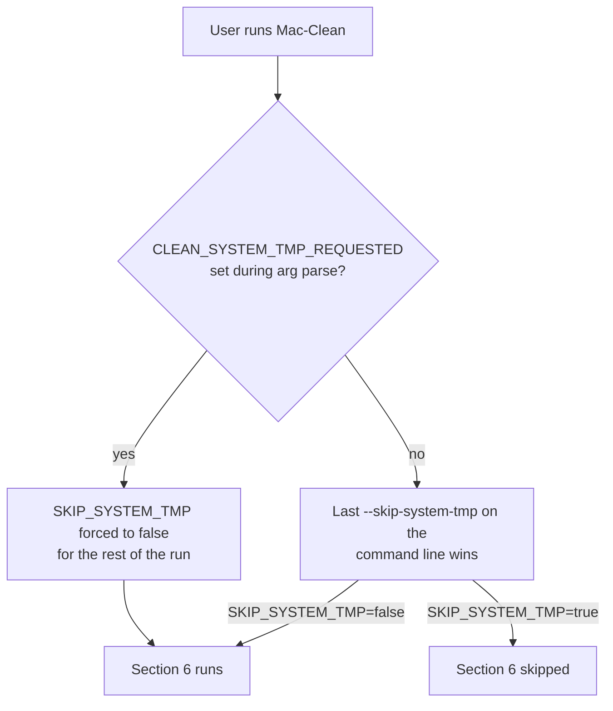

# Command Reference

Complete reference for all Mac-Clean command-line options.

## `--clean-system-tmp` vs `--skip-system-tmp`

`/tmp` and `/var/tmp` cleanup is **off by default** for safety. The
order of these flags on the command line does **not** matter — whichever
wins is sticky for the rest of the run.



| Command | Effect |
|---|---|
| `Mac-Clean --skip-system-tmp` | Skips `/tmp` (default behavior). |
| `Mac-Clean --clean-system-tmp` | Cleans `/tmp` and `/var/tmp`. |
| `Mac-Clean --skip-system-tmp --clean-system-tmp` | Cleans. `clean` wins. |
| `Mac-Clean --clean-system-tmp --skip-system-tmp` | Cleans. `clean` still wins. |

## Quick Reference

| Flag | Description |
|------|-------------|
| `--dry-run`, `-n` | Preview only, don't delete |
| `--yes`, `-y` | Skip confirmation |
| `--force`, `-f` | Skip ALL confirmations |
| `--interactive`, `-i` | Interactive selection |
| `--quiet`, `-q` | Minimal output |
| `--json`, `-j` | JSON output |
| `--profile NAME` | Use preset profile |
| `--skip-X` | Skip specific category |
| `--threshold N` | Only run if disk > N% |
| `--help` | Show help |
| `--version` | Show version |

---

## Cleanup Modes

### --dry-run

Preview what would be cleaned without deleting anything. **Always use this first.**

```bash
sudo Mac-Clean --dry-run
```

**Always run `--dry-run` before actual cleanup.**

---

### --yes

Skip the confirmation prompt and clean everything.

```bash
sudo Mac-Clean --yes
```

You'll still see warnings for potentially destructive operations (Xcode, iOS backups).

---

### --force

Skip ALL confirmation prompts, including dangerous operations.

```bash
sudo Mac-Clean --force
```

**Warning:** This will delete Xcode Derived Data and other potentially important caches without asking.

---

### --interactive

Show an interactive menu to select which categories to clean.

```bash
sudo Mac-Clean --interactive
```

**Controls:**
- Arrow keys: Navigate
- Space: Toggle selection
- Enter: Confirm and start
- 'a': Select all
- 'n': Deselect all
- 'q': Quit

---

## Output Modes

### --quiet

Minimal output. Useful for cron jobs.

```bash
sudo Mac-Clean --yes --quiet
```

Shows only warnings and errors.

---

### --json

Output results in JSON format for automation and monitoring.

```bash
sudo Mac-Clean --dry-run --json
```

**Example output:**
```json
{
  "version": "5.7.0",
  "timestamp": "2026-06-05T18:30:00Z",
  "dry_run": true,
  "results": {
    "categories": {
      "processed": [
        "Homebrew Cache",
        "Browser Testing Tool Caches"
      ],
      "skipped": [
        "Time Machine Local Snapshots"
      ],
      "details": {
        "Time Machine Local Snapshots": {
          "status": "skipped",
          "skip_flag": "--skip-snapshots"
        },
        "Homebrew Cache": {
          "status": "would_run",
          "skip_flag": "--skip-homebrew"
        },
        "Browser Testing Tool Caches": {
          "status": "would_run",
          "skip_flag": "--skip-browser-tools",
          "estimated_bytes": 1610612736,
          "estimated_human": "1.5G"
        }
      }
    },
    "disk_usage": {
      "before": 85,
      "after": null
    },
    "space_freed": {
      "bytes": 1610612736,
      "human": "1.50 GB"
    }
  }
}
```

**The `details` object** (added in v5.7.0) gives you per-category info
for scripting — status (`would_run` or `skipped`), the skip flag,
and (when known) the size estimate. Use it like:

```bash
# What would get cleaned up?
sudo Mac-Clean --dry-run --json | jq '.results.categories.details | to_entries | map(select(.value.status == "would_run")) | .[].key'

# Which categories were skipped and why?
sudo Mac-Clean --dry-run --json | jq '.results.categories.details | to_entries | map(select(.value.status == "skipped")) | map({category: .key, flag: .value.skip_flag})'

# Sum of all estimated bytes for would_run categories
sudo Mac-Clean --dry-run --json | jq '[.results.categories.details | to_entries[] | select(.value.status == "would_run" and .value.estimated_bytes != null) | .value.estimated_bytes] | add'
```

Note: `estimated_bytes` / `estimated_human` are populated only for
categories whose section body calls `record_category_size`. As of
v5.7.0, that's categories #29 (Browser Testing Tool Caches), #30
(Crash Reports), and #31 (User Tool Caches). Other categories still
appear in `details` with just `status` and `skip_flag`.

---

### --verbose

Show detailed debug output.

```bash
sudo Mac-Clean --dry-run --verbose
```

---

### --no-color

Disable colored output.

```bash
sudo Mac-Clean --dry-run --no-color
```

Useful when saving output to a file or piping.

---

## Selection Modes

### --profile

Use a preset profile.

```bash
sudo Mac-Clean --profile conservative --yes
sudo Mac-Clean --profile developer --yes
sudo Mac-Clean --profile aggressive --yes
sudo Mac-Clean --profile minimal --yes
```

See [Profiles](../how-to/profiles.md) for details.

---

### --skip-X

Skip specific cleanup categories.

```bash
# Skip multiple
sudo Mac-Clean --yes --skip-xcode --skip-docker

# All available skip flags
sudo Mac-Clean --yes \
  --skip-snapshots \
  --skip-homebrew \
  --skip-spotify \
  --skip-claude \
  --skip-xcode \
  --skip-browsers \
  --skip-npm \
  --skip-pip \
  --skip-trash \
  --skip-dsstore \
  --skip-docker \
  --skip-simulator \
  --skip-mail \
  --skip-siri-tts \
  --skip-icloud-mail \
  --skip-photos-library \
  --skip-icloud-drive \
  --skip-quicklook \
  --skip-diagnostics \
  --skip-ios-backups \
  --skip-ios-updates \
  --skip-cocoapods \
  --skip-gradle \
  --skip-go \
  --skip-bun \
  --skip-pnpm \
  --skip-browser-tools \
  --skip-crash-reports \
  --skip-user-tool-caches \
  --skip-jvm \
  --skip-system-tmp \
  --clean-system-tmp
```

See [All Categories](categories.md) for details.

---

### --threshold

Only run cleanup if disk usage is above the threshold percentage.

```bash
# Only run if disk is more than 80% full
sudo Mac-Clean --yes --threshold 80
```

**Use case:** Automate cleanup to only run when needed.

---

### --photos-library

Specify Photos library name or "all" to clean all libraries.

```bash
# Clean specific library
sudo Mac-Clean --yes --photos-library "Photos Library.photoslibrary"

# Clean all libraries
sudo Mac-Clean --yes --photos-library all
```

---

### --update

Run `brew update` before cleanup (Homebrew only).

```bash
sudo Mac-Clean --yes --update
```

---

## Information Flags

### --help

Show help message and exit.

```bash
Mac-Clean --help
```

---

### --version

Show version number and exit.

```bash
Mac-Clean --version
```

---

## Exit Codes

| Code | Meaning |
|------|---------|
| `0` | Success - cleanup completed |
| `1` | Error - something went wrong |
| `130` | Interrupted - Ctrl+C pressed |

---

## --dry-run vs --yes vs --force

Understanding the difference is crucial for safe operation.

| Flag | Deletes Files | Asks Confirm | Warns About Dangerous Ops |
|------|-------------|-------------|------------------------|
| `--dry-run` | No | No | Yes |
| `--yes` | Yes | No | Yes |
| `--force` | Yes | No | No |

**Recommended workflow:**
1. `sudo Mac-Clean --dry-run` - Preview
2. `sudo Mac-Clean --yes` - Clean (with safety warnings)
3. `sudo Mac-Clean --force` - Only when you're sure

---

## Configuration Precedence

Command-line flags override config files, which override defaults.

```
Command Line > Environment Variables > Config File > Defaults
```

**Example:** If `~/.maccleans.conf` has `SKIP_XCODE=true` but you run `sudo Mac-Clean --skip-xcode=false --yes`, the `--skip-xcode=false` takes precedence.

---

## Examples

### Preview everything

```bash
sudo Mac-Clean --dry-run
```

### Clean with confirmation

```bash
sudo Mac-Clean --yes
```

### Clean everything, no warnings

```bash
sudo Mac-Clean --force
```

### Interactive selection

```bash
sudo Mac-Clean --interactive
```

### Use developer profile

```bash
sudo Mac-Clean --profile developer --yes
```

### Skip specific categories

```bash
sudo Mac-Clean --yes --skip-xcode --skip-docker
```

### Only if disk is nearly full

```bash
sudo Mac-Clean --yes --threshold 85
```

### Quiet output for cron

```bash
sudo Mac-Clean --yes --quiet --threshold 80
```

### JSON output for monitoring

```bash
sudo Mac-Clean --dry-run --json | jq '.results.space_freed'
```

### With Homebrew update

```bash
sudo Mac-Clean --yes --update
```

---

<p align="center">

[Back to Documentation](../README.md) · [Configuration](../how-to/configure.md) · [Error Codes](exit-codes.md)

</p>
